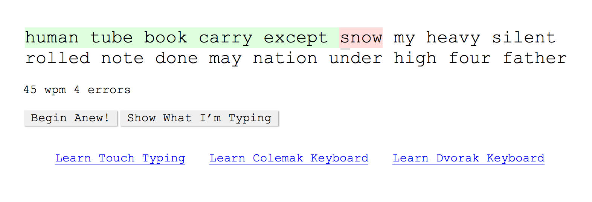

# Practical Type

Learn and practice touch typing with timed exercises using the most common words in the English language. 

Practical Type is perfect for improving touch typing skills or learning a new keyboard layout, such as Dvorak or [Colemak](https://colemak.com/).

Try it out: <https://barberboy.github.io/practical-type>

## Author

Benjamin Barber

## License

ISC